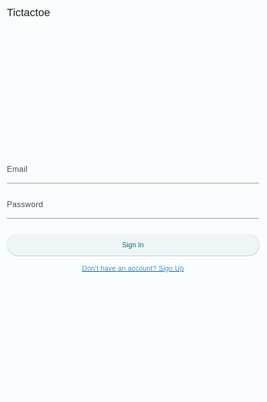
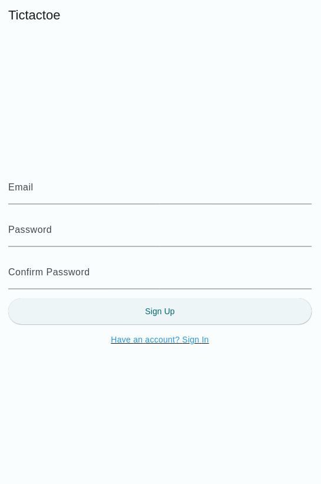
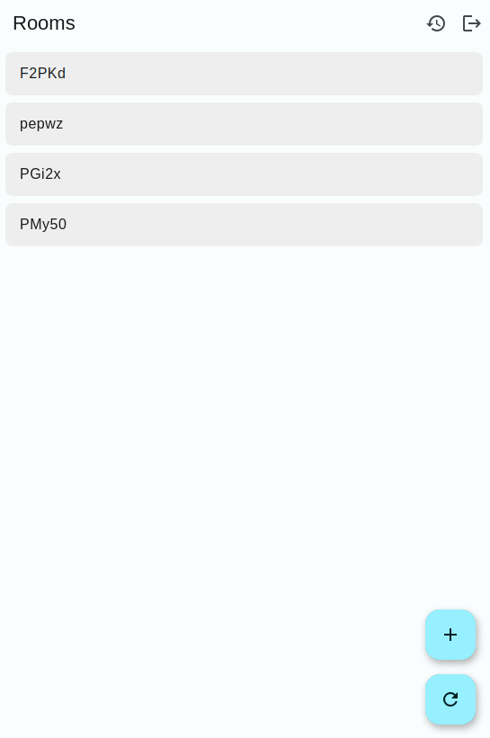
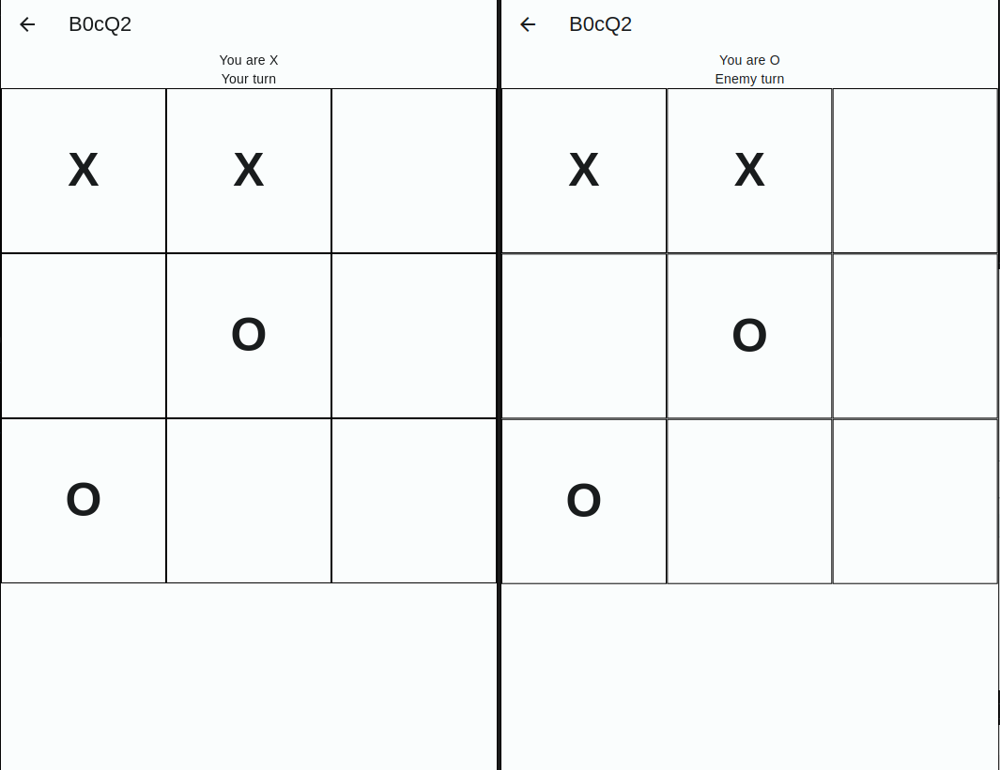
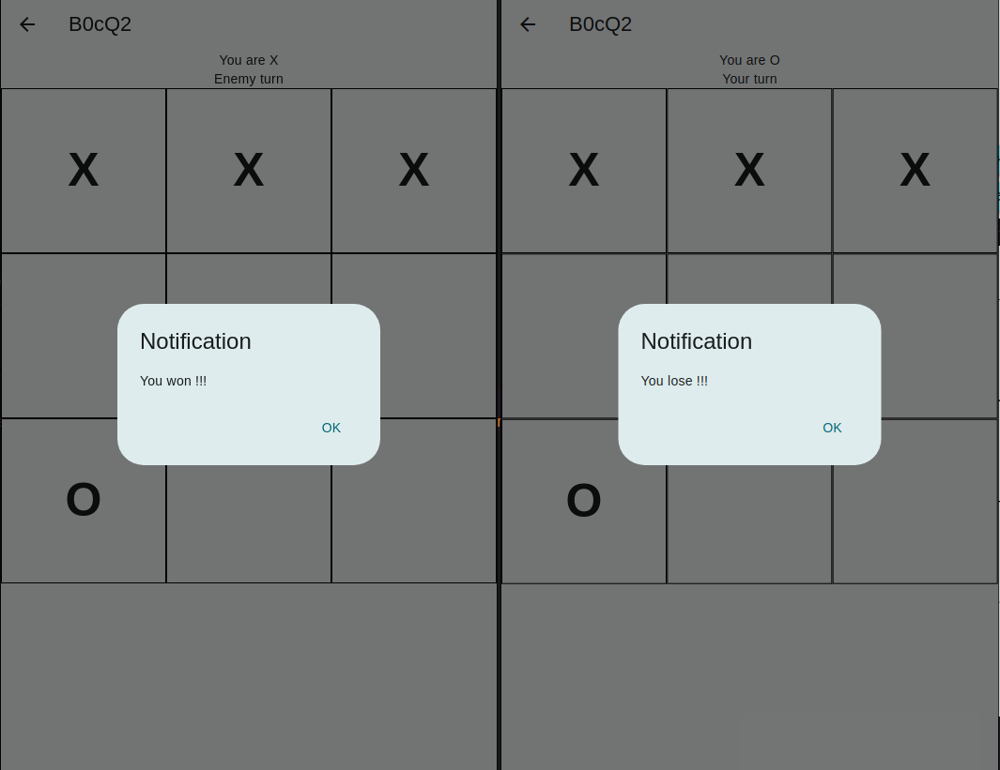

# X-O online

## Techstack

- Client: Flutter, Firebase Auth, Firebase CloudStore, Pusher
- Server: Laravel, Pusher

## Description

- Đăng ký, đăng nhập với Firebase Auth
- Lưu lịch sử với Firebase CloudStore
- Realtime qua Pusher

## Installation

```bash
# Pull repository
git pull https://github.com/kieuvu/tictactoe-wsk-flutter

# Install Composer
php -r "copy('https://getcomposer.org/installer', 'composer-setup.php');"
php -r "if (hash_file('sha384', 'composer-setup.php') === 'dac665fdc30fdd8ec78b38b9800061b4150413ff2e3b6f88543c636f7cd84f6db9189d43a81e5503cda447da73c7e5b6') { echo 'Installer verified'; } else { echo 'Installer corrupt'; unlink('composer-setup.php'); } echo PHP_EOL;"
php composer-setup.php
php -r "unlink('composer-setup.php');"
sudo mv composer.phar /usr/local/bin/composer

# Install Server Dependencies
cd tictactoe-server
composer install

# Install Server Dependencies
cd ..
cd tictactoe
flutter pub get
```

## Screenshots

|  |  |
|------------------------|--------------------------|

|  |  |
|------------------------|--------------------------|





- Sử dụng Github: 1
- Chức năng liên quan đến Cloud Storage: 2
- Giao diện người dùng:  2
- Hoàn thành chức năng: 2
